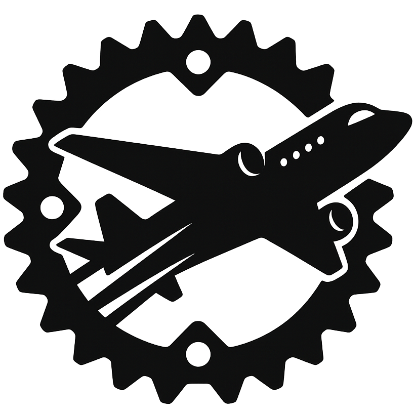

#  JetStream   <!--gh actions-->  

JetStream is an RPC framework built on top of s2n-quic and p9.

Features:

- Bidirectional streaming
- 0-RTT
- mTLS
- binary encoding

## Motivation

Building remote filesystems over internet, is the main motivation behind JetStream.

## Ready?

JetStream is not ready for production use. It's still in the early stages of development.

## Alternatives

- [grpc](https://grpc.io/)
- [capnproto](https://capnproto.org/)
- [thrift](https://thrift.apache.org/)
- [jsonrpc](https://www.jsonrpc.org/)
- [xmlrpc](http://xmlrpc.scripting.com/)

## License

BSD-3-Clause like the rest of the rust-p9 packages this relises on. 